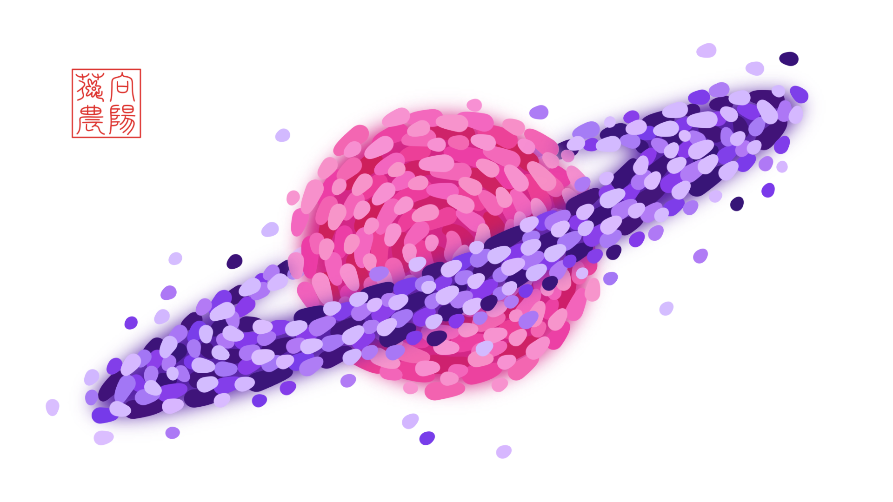

# 送你一朵牵牛花

***A Morning Glory for You***

一天清晨，阳光唤醒了睡梦中的向阳花花农。昨晚悄悄爬上窗沿的牵牛花，和他一起伸着懒腰。那一朵朵淡紫色的小喇叭，在薄雾中缓缓摇曳，轻声哼出无人听过的小调。他趴在窗前安静地听了许久，仿佛它们在讲述一个悠远的故事。

## 留

***Stay***

> - 🎼 原曲：《[萧煌奇 - 寂寞而已](https://music.163.com/song?id=2619098561)》
> - 🌟 灵感：2024年电视剧《[某某](https://www.imdb.com/title/tt33098983)》。
> - 🔍 大意：一开始陌生的两人，互相产生了难以克制的感情，在对方心中占据越来越重要的位置，从双向暗恋到双向奔赴。

*Verse 1 委屈*\
`[03集38:55 SW]` 看似要好 话都没怎么讲过\
`[03集39:12 SW]` 这种陌生 比感冒还难受\
`[05集47:04 SW]` 想你留下 亏我努力了好久\
`[05集40:53 SW]` 久到以为 我们超越朋友

*Pre-chorus 无力*\
`[05集48:09 SW]` 莫名起风了 戛然风停了 算了……

*Chorus 1 迷惘*\
`[02集30:30 SW]` 你给的欢喜 被我藏在嘴角\
`[01集44:12 SW]` 扑通心跳 如蝉鸣般聒噪\
`[03集51:00 SW]` 一瞬间 我世界颠倒\
`[02集02:50 SW]` 一声哥 出于几分礼貌？\
`[12集20:00 SW]` 一定是 疯掉！

*Verse 2 心软*\
`[03集13:41 JT]` 很小心地示好 又不甘示弱\
`[02集44:42 JT]` 像抒情文 无法直白说破\
`[03集29:18 JT]` 如果这轮因果 就是结果\
`[03集49:55 JT]` 其实我们 可以试着变熟

*Chorus 2 羁绊*\
`[05集16:08 JT]` 不想你发现 是我为你伸张\
`[05集19:41 JT]` 背着你 时间走得多漫长\
`[07集29:39 JT]` 一起在 彩虹下游荡\
`[07集37:50 JT]` 一根绳 绑上归属记号\
`[--集--:-- JT]` 一牵手 糟糕！

*Bridge 奔赴*\
`[07集16:27 SW]` 小流浪猫 拖行李箱\
`[01集38:29 SW]` 我逮住 还想逃？\
`[07集38:42 SW]` 有我守护 在你安心的地方\
`[04集38:10 JT]` 过去不再重要\
`[08集39:37 JT]` 现在我决定沿着光\
`[04集06:27 JT]` 径直奔向 你的拥抱

*Chorus 3 承诺*\
`[06集37:32 SW]` 留住你 是我最永恒的倔强\
`[05集31:34 SW]` 别把我推开 随时能依靠\
`[06集35:20 SW]` 不打烊 来一颗果糖\
`[06集35:00 SW]` 不敷衍 卸下一切伪装\
`[--集--:-- SW]` 不松手 抓牢

*Chorus 4 承诺*\
`[05集19:10 JT]` 不会什么都不做 任你受伤\
`[07集06:19 JT]` 麻烦和荣誉 全部与你共享\
`[08集27:57 JT]` 一把钥匙 一眼脉脉对望\
`[06集36:05 JT]` 一路喧嚣 日与夜 每分每秒\
`[06集34:20 JT & SW]` 别后悔 不后悔 说好
