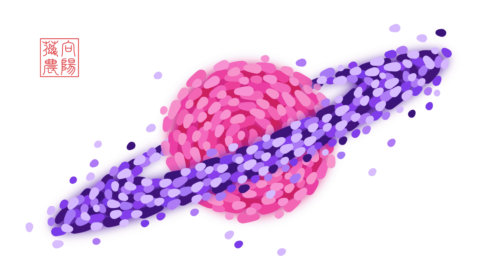

<!-- Created by 向阳花花农 (The Sunflorist) on 2024-11-22. -->
<!-- The Sunflorist's Shangri-La © 2024 by The Sunflorist is licensed under CC BY-NC-SA 4.0, all rights reserved. -->

# 送你一簇牵牛花

***A Morning Glory for You***

一天清晨，阳光唤醒了睡梦中的向阳花花农。昨晚悄悄爬上窗沿的牵牛花，和他一起伸着懒腰。那一朵朵淡紫色的小喇叭，在薄雾中缓缓摇曳，轻声哼出无人听过的小调。他趴在窗前安静地听了许久，仿佛它们在讲述一个悠久而遥远的故事。



## 留

***Stay***

<!-- 广州 2024-09-17 -->

> - {{ music }}：《[萧煌奇 - 寂寞而已](https://music.163.com/song?id=2619098561)》
> - {{ idea }}：2024年电视剧《[某某](https://www.imdb.com/title/tt33098983)》。
> - {{ meaning }}：一开始陌生的两人，互相产生了难以克制的感情，在对方心中占据越来越重要的位置，从双向暗恋到双向奔赴。

```{line-block}
*VERSE 1 委屈*
`[03集38:55 盛望]` 看似要好 话都没怎么讲过
`[03集39:12 盛望]` 这种陌生 比感冒还难受
`[05集47:04 盛望]` 想你留下 亏我努力了好久
`[05集40:53 盛望]` 久到以为 我们超越朋友

*PRE-CHORUS 无力*
`[05集48:09 盛望]` 莫名起风了 戛然风停了 算了……

*CHORUS 1 迷惘*
`[02集30:30 盛望]` 你给的欢喜 被我藏在嘴角
`[01集44:12 盛望]` 扑通心跳 如蝉鸣般聒噪
`[03集51:00 盛望]` 一瞬间 我世界颠倒
`[02集02:50 盛望]` 一声哥 出于几分礼貌？
`[12集20:00 盛望]` 一定是 疯掉！

*VERSE 2 心软*
`[03集13:41 江添]` 很小心地示好 又不甘示弱
`[02集44:42 江添]` 像抒情文 无法直白说破
`[03集29:18 江添]` 如果这轮因果 就是结果
`[03集49:55 江添]` 其实我们 可以试着变熟

*CHORUS 2 羁绊*
`[05集16:08 江添]` 不想你发现 是我为你伸张
`[05集19:41 江添]` 背着你 时间走得多漫长
`[07集29:39 江添]` 一起在 彩虹下游荡
`[07集37:50 江添]` 一根绳 绑上归属记号
`[--集--:-- 江添]` 一牵手 糟糕！

*BRIDGE 奔赴*
`[07集16:27 盛望]` 小流浪猫 拖行李箱
`[01集38:29 盛望]` 我逮住 还想逃？
`[07集38:42 盛望]` 有我守护 在你安心的地方
`[04集38:10 江添]` 过去不再重要
`[08集39:37 江添]` 现在我决定沿着光
`[04集06:27 江添]` 径直奔向 你的拥抱

*CHORUS 3 承诺*
`[06集37:32 盛望]` 留住你 是我最永恒的倔强
`[05集31:34 盛望]` 别把我推开 随时能依靠
`[06集35:20 盛望]` 不打烊 来一颗果糖
`[06集35:00 盛望]` 不敷衍 卸下一切伪装
`[--集--:-- 盛望]` 不松手 抓牢

*CHORUS 4 承诺*
`[05集19:10 江添]` 不会什么都不做 任你受伤
`[07集06:19 江添]` 麻烦和荣誉 全部与你共享
`[08集27:57 江添]` 一把钥匙 一眼脉脉对望
`[06集36:05 江添]` 一路喧嚣 日与夜 每分每秒
`[06集34:20 江添 & 盛望]` 别后悔 不后悔 说好
```

## 劫

***Doom***

<!-- 广州 2024-09-25 -->

> - {{ music }}：《[川崎鹰也 - 夕阳之上](https://music.163.com/song?id=2603686865)》
> - {{ idea }}：在情窦初开时，喜欢上一个不可能在一起的男孩。
> - {{ meaning }}：收到男孩的婚礼邀请后，年少时与他有关的记忆慢慢浮现。从记忆中回过神来，才发现自己已经在婚礼现场，而幻想中的表白从没发生过，与男孩的关系止步于暧昧和暗恋。如今男孩即将完婚，放下是最体面的选择。

```{line-block}
*VERSE 1 婚约*
拆开信封 是一张绯红请柬
囍气洋溢 择良辰结佳缘
婚纱照里 看新郎笑得多甜
如年少时 对我温柔满眼

*PRE-CHORUS 1 萌动*
那是很久以前 猝不及防的夏天
他呼吸 第一次 贴近我侧脸
难言情结 若隐若现

*CHORUS 1 暗恋*
肆意暧昧 愈演愈烈 轻易就沦陷
期待转角处 和他擦肩
漫漫长夜 浮想联翩
什么关系？怎么分辨？直觉或错觉？
试探着 跨越界限
耗尽勇气 赌上了一切

*VERSE 2 拒绝*
意料之中 这是我一厢情愿
然而拒绝 让人痛到极点
一字一句 不顾及我的尊严
狼狈心情 早已声嘶力竭

*PRE-CHORUS 2 心碎*
就像身中万箭 被推入万丈深渊
锋利又窒息的话 萦绕耳边
毁我世界 一地碎片

*CHORUS 2 陌路*
刻意回避 视而不见 会好受一些
曾经的我们 渐行渐远
后来只剩下 敷衍寒暄
蓦然回首 时隔多年 依旧没忘却
都怪我 贪得无厌
形同陌路 也在所难免

*BRIDGE 追悔*
如果当初 坚守住底线
如果识破 玩笑的欺骗
还会不会诀别？
如果这次 放弃去冒险
如果心里话 锁在心里面
能不能 回到那个夏天？
能不能 把故事重写一遍？

*CHORUS 3 放下*
如梦初醒 转眼之间 仪式将完结
男孩倾诉 神圣的誓言：
今生今世 忠贞不变
一往情深 埋葬心田 就让它湮灭
到此为止 别流连
是时候 跟过去说再见
```
