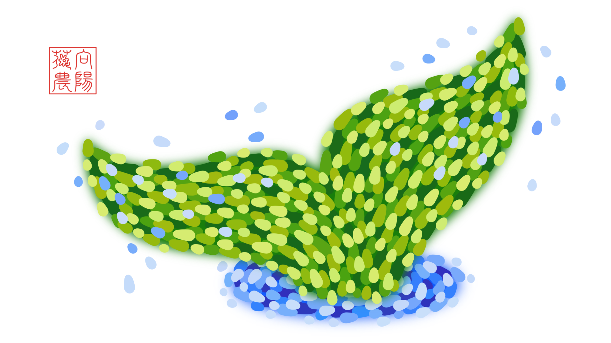

# 送你一朵红玫瑰

***A Red Rose for You***

阳光每天都会照耀向阳花花农的花海，花海里生长着一种稀有的玫瑰，玫瑰一生只开一朵花，一朵花的花期长达一千年，一千年之后只留下一粒种子，种子在真诚的土壤中才会再次抽出嫩芽，嫩芽变强壮离不开温存的阳光，阳光每天都会照耀向阳花花农的花海……

## 我也爱你！

***I Love You, Too!***

第一次，\
我正忘乎所以地谈天说地，\
你忽然打住我说：\
“我想我已经爱上你。”\
而我说：“我也爱你！”

有一次，\
你嫌我碍手碍脚，\
把我从厨房赶到客厅。\
而我说：“我也爱你！”

每一次，\
我为你准备礼物，\
你总怕太贵却隐隐开心。\
而我说：“我也爱你！”

最后一次，\
我吻了你枯黄的额头，\
你叮嘱我要照顾好自己。\
而我说：“我也爱你！”

---

At the very first time,\
I was talking a lot with enthusiasm,\
Until you shushed me and said,\
"I think I'm in love with you."\
And I said, "I love you, too!"

Once upon a time,\
You disliked me helping nothing,\
So kicked me out of the kitchen.\
And I said, "I love you, too!"

Every single time\
I prepared a gift for you,\
You worried about the price,\
But I knew you liked it.\
And I said, "I love you, too!"

For the last time,\
I kissed your wrinkled forehead,\
When you told me not to be sad.\
And I said, "I love you, too!"

> 🌼 余香：在你的每个动作、每个表情、每句没有明说的话里，都藏着一句“我爱你！”所以对于以上的种种，“我也爱你！”是亘古不变的回应。
