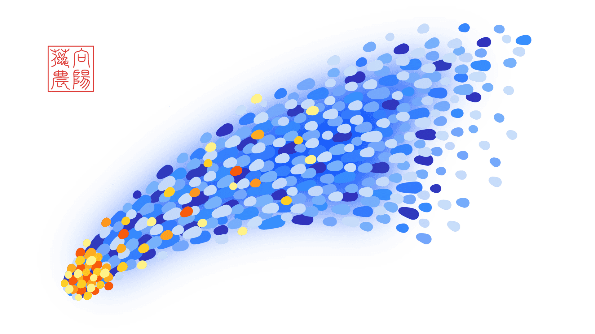

<!-- Created by 向阳花花农 (The Sunflorist) on 2024-11-22. -->
<!-- The Sunflorist's Shangri-La © 2024 by The Sunflorist is licensed under CC BY-NC-SA 4.0, all rights reserved. -->

# 送你一棵向日葵

***A Sunflower for You***

夜幕将至，向阳花花农结束了一天的耕作。当他经过种满向日葵的小山丘时，他把它们收集的阳光装进玻璃瓶里带回家，一屋子的黑暗吓得以光速逃之夭夭，唯独留下了赖在脚底的影子们。无论这些阴影如何地蠢蠢欲动，他都毫不在意，因为他的眼里只有光。



## 因为喜欢

***Out of Passion***

<!-- 广州 2024-10-03 -->

```{line-block}
因为喜欢，
所以他向她单膝跪地；
因为喜欢，
所以他种下向日葵，
即使身处荒寂。

可是喜欢
无法承诺他柳暗花明；
可是放弃喜欢
曾害他形如枯槁，
死灰其心。
```

---

```{line-block}
Out of passion for her,
He gets down on one knee.
Out of passion for sunflowers,
He grows them
Even on a land of nothing.

But with passion,
The blooming remains unguaranteed.
But giving up on his passion
Has withered his body
And ashed his spirit.
```

> {{ more }}
>
> 选择做喜欢的事，是勇敢的；能够从喜欢的事中获得安全感，是幸运的。希望每个人的勇敢都被幸运眷顾，希望每个人都因为热爱而鲜活，就像出于同样的原因，才决定和喜欢的人厮守一生。

## 阳光电池

***Sunshine Cell***

<!-- 广州 2024-10-08 -->

```{line-block}
他有一块太阳能电池，
里面蓄满了阳春三月的晨光、
南方海滩的艳阳、
破茧成蝶的豁亮
和儿时梦想的星芒。

当这块电池释放能量，
那会是消融寒冬的热量、
压垮磨难的重量、
振聋发聩的音量
和打败绝望的力量。
```

---

```{line-block}
He has a solar cell,
In which stores up the dawn of spring,
The sunshine on a southern beach,
The first light that a butterfly sees,
And the twinkle of his childhood dreams.

Once the cell releases its energy,
That will be the heat to melt winters,
The weight to crush barriers,
The sound to awaken strayers,
And the power to defeat despairs.
```

> {{ more }}
>
> 2022年电视剧《[我的解放日志](https://movie.douban.com/subject/35322421)》第02集03:40，廉美贞和同事之间的对话。“要是冬天快点来就好了。”“到了冬天肯定又要说：‘赶紧到夏天吧。’记住现在的心情，等到冬天冷的时候再用吧。好好保存到冬天。”“那现在用冬天的记忆不就好了吗？有没有天冷时保留的回忆啊？”

## 有的纸

***Some Paper***

<!-- 广州 2024-11-02 -->

```{line-block}
有的纸记载着往圣绝学[^wisdom]，
本该引得洛阳纸贵，
却落得后继无人。
有的纸先是印满了问题，
然后填满了答案，
最终换来一个得分。
有的纸签上大名、盖上钢印，
像一张人生巅峰的通关文牒，
更像是华而不实的证明。
有的纸有最牢固的防伪技术，
让多少人丧尽天良？
又让多少人依旧趋之若鹜？

有的纸是素描，因为划上了石墨；
有的纸是乐章，因为记下了音高；
还有的纸，不过是不起眼的诗作。

有的纸来自同一片森林，
长着相同圈数的年轮，
拥抱过同一阵晚风，
摊上了不同的地球人。
```

[^wisdom]: “往圣绝学”出自【北宋】张载《[横渠四句](https://hanyu.baidu.com/shici/detail?pid=304896ec1a1799aa53623a9f93e4543e)》。

---

```{line-block}
Some paper preserves the greatest minds' wisdom,
Which should've been overwhelmingly popular,
Instead of being abandoned and ignored.
Some paper is fully printed with questions,
Then filled with answers,
And finally, it turns into a score.
Some paper gets a signature and a steel seal,
As if it's a passport to a triumphant life,
But rather proves that one is merely flashy.
Some paper carries the most robust anti-forgery tech,
Tempting how many people to lose their conscience,
And how many people to go on scrambling for it?

With graphite, some paper becomes a pencil sketch.
With pitch, some paper becomes a movement.
Also, some paper becomes an ordinary poem.

Some paper comes from the same forest,
Has the same number of annual rings,
And embraces the same night breeze,
While ends up in the hands of different humans.
```

> {{ more }}
>
> 书籍、考卷、文凭、钞票……纸，早已被悄无声息地划分出三六九等，但纸的价值或许因人而异。哪张纸对自己最重要？画册，乐谱，诗篇，或是其它？当停止亦步亦趋，当抵达内心最深处，人生的意义才慢慢浮现纸上。

## 愿望的信徒

***A Wish-Believer***

<!-- 广州 2024-11-25 -->

```{line-block}
寺院的菩提树上
飘满红色的愿望，
喷泉的池底
沉满圆形的愿望。

那掌管愿望的神明们
有多么碌碌忙忙？
连双子座流星雨
也只当他是在空想。

但吹灭生日蜡烛前，
他仍虔诚地十指相交，
虔诚地相信他的愿望，
相信自己的梦自己造。
```

---

```{line-block}
On the Bodhi Tree in the temple
Fluttered hundreds of red wishes.
To the bottom of the fountain
Sank thousands of round wishes.

How busy they were,
The gods of wishes!
The Geminids also thought
He was daydreaming.

However, facing his birthday candles,
He made a wish devoutly as last year,
Which he truly believes,
And only himself can realize.
```

> {{ more }}
>
> 2023年电影《[Wish](https://movie.douban.com/subject/36090455)》15:02，Magnifico: “People think wishes are just ideas. But no, they are a part of your heart. The very best part.”
