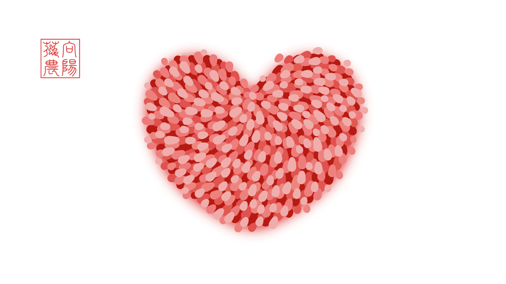

<!-- Created by 向阳花花农 (The Sunflorist) on 2024-11-22. -->
<!-- The Sunflorist's Shangri-La © 2024 by The Sunflorist is licensed under CC BY-NC-SA 4.0, all rights reserved. -->

# 送你一束白玫瑰

***A White Rose for You***

阳光每天都会照耀向阳花花农的花海，花海里生长着一种稀有的玫瑰，玫瑰一生只开一朵花，一朵花的花期长达一千年，一千年之后只留下一粒种子，种子在真诚的土壤中才会再次抽出嫩芽，嫩芽变强壮离不开温存的阳光，阳光每天都会照耀向阳花花农的花海……



## 我也爱你！

***I Love You, Too!***

<!-- 广州 2024-10-23 -->

```{line-block}
第一次，
我正忘乎所以地谈天说地，
你忽然打住我说：
“我想我已经爱上你。”
而我说：“我也爱你！”

有一次，
你嫌我碍手碍脚，
把我从厨房赶到客厅。
而我说：“我也爱你！”

每一次，
我为你准备礼物，
你总怕太贵却隐隐开心。
而我说：“我也爱你！”

最后一次，
我吻了你枯黄的额头，
你叮嘱我要照顾好自己。
而我说：“我也爱你！”
```

---

```{line-block}
At the very first time,
I was talking a lot with enthusiasm,
Until you shushed me and said,
"I think I'm in love with you."
And I said, "I love you, too!"

Once upon a time,
You disliked me helping nothing,
So kicked me out of the kitchen.
And I said, "I love you, too!"

Every single time
I prepared a gift for you,
You worried about the price,
But I knew you liked it.
And I said, "I love you, too!"

For the last time,
I kissed your wrinkled forehead,
When you told me not to be sad.
And I said, "I love you, too!"
```

> {{ more }}
>
> 在你的每个动作、每个表情、每句没有明说的话里，都藏着一句“我爱你！”所以对于以上的种种，“我也爱你！”是亘古不变的回应。

## 从此过着幸福的生活

***Live Happily Ever After***

<!-- 广州 2024-10-25 -->

```{line-block}
当我们三十多岁，
在周六晚上，我们相互依偎，
重温一部二十多岁的爱情电影，
不知多少次感动落泪。

当我们四十多岁，
你躲在书店，吵架后没人安慰。
我只好模仿二十多岁时的邂逅，
哄你回家，重新来过一回。

当我们五十多岁，
初雪见证我送你一支白玫瑰，
大街上二十多岁的小年轻
也用羡慕的眼光将我们包围。

当我们六十多岁，
为了两屉灌汤包，我排好久的队。
你依旧喜欢，我依旧记得
你从二十多岁就最爱这口味。

当我们七十多岁，
你把当年的嫁衣翻出衣柜，
让小外孙女换上了它，
她和你二十多岁时一样美。

当我们八十多岁，
步履蹒跚，思绪也衰颓，
就像从前，车、马、邮件都慢，[^slow]
就像被二十多岁的回忆灌醉。

当我们九十多岁，
皱纹间镌刻着童话结尾：
我们无比幸福地度过了一生，
自二十多岁起，一路相陪。
```

[^slow]: “就像从前，车、马、邮件都慢”出自木心的诗歌《[从前慢](https://baike.baidu.com/item/从前慢/17158480)》第三小节。

---

```{line-block}
In our thirties,
We snuggled up to each other on Saturday nights,
Rewatching a romance movie that was over twenty years old,
Without knowing how many times we were moved to tears.

In our forties,
You hid in the bookstore after our fight, expecting comfort.
I had to coax you by pretending the encounter in our twenties,
So you could come home with me and give us another try.

In our fifties,
I handed you a white rose witnessed by the first snow,
And by jealous young people in their twenties
Surrounding us on the street.

In our sixties,
I waited in a long line for two steamers of tangbao.
You still liked it, and I still remembered that
You've been loving it since your twenties.

In our seventies,
You took out your wedding gown from the closet,
Letting our youngest granddaughter put on it,
And she looked as beautiful as you in your twenties.

In our eighties,
We walked slower and thought slower,
At a similar speed to that of carriages and mails before,
Like we got drunk on memories of our twenties.

In our nineties,
The end of our fairy tale was engraved on our wrinkles:
We've enjoyed the happiest ever life,
Which we've been sharing since our twenties.
```

> {{ more }}
>
> 在王子和公主的童话结尾，“他们从此过着幸福的生活。”后来王子的白马老了，公主的水晶鞋失去了光泽，精灵藏到了森林深处，最后一只独角兽也销声匿迹。当新的恶龙不断出现，唯一能打败它们的，仍旧是关于爱的魔法。
